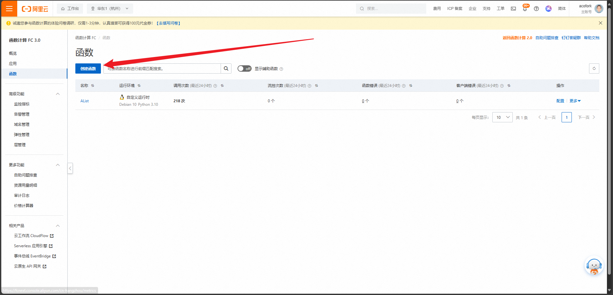
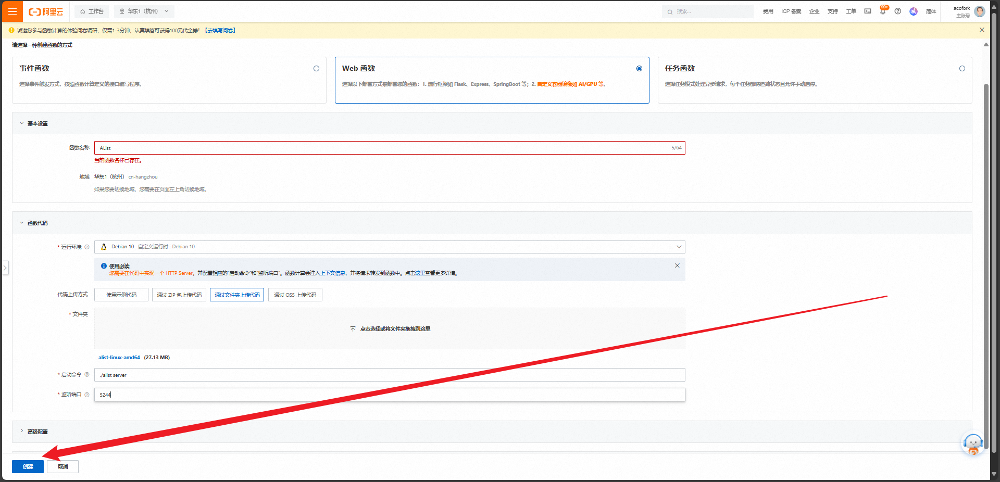
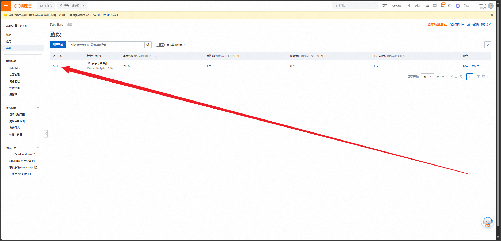
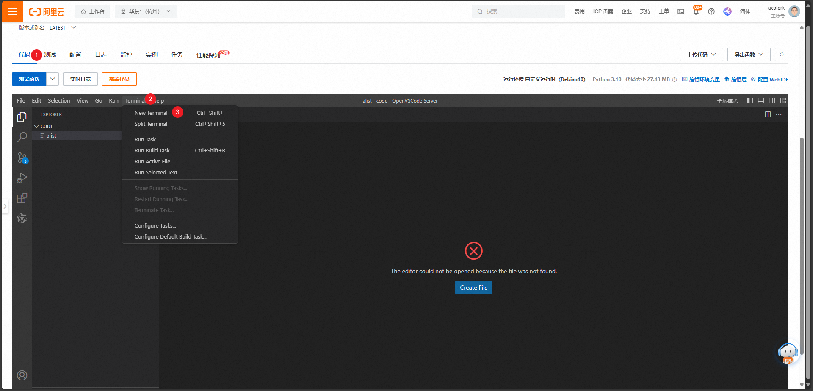

先下载AList最新版的Linux-amd64可执行文件，其放到一个空文件夹：[Release Latest · AlistGo/alist · GitHub](https://github.com/AlistGo/alist/releases/latest)

前往：[函数计算 FC](https://fcnext.console.aliyun.com/overview)

选择创建函数

创建一个Web函数，如图填写信息。将你的文件夹上传。然后创建

进入已经创建完毕的函数控制面板

依次进入 代码 -> Terminal -> New Terminal

输入`./alist server`会自动在左边创建data目录

替换内容（你本地部署一个AList，也会有一个`data`文件夹，如果你不是跨版本可以直接覆盖`data`文件夹，如果你跨版本需要手动配置`config.json`并且替换`data.db`）确认测试环境无异常后直接部署代码即可

来到 配置 -> 触发器 复制公网HTTPS地址。这就是你的AList后端地址，如果你有备案域名，可绑定自定义域名来实现访问。如果你没有，可以将其作为后端API使用，在Cloudflare Pages部署AList_Web项目即可，教程：[教你把AList的前端部署到CF Pages！让你的AList秒加载！](/posts/alist-web-for-cf-page/)
