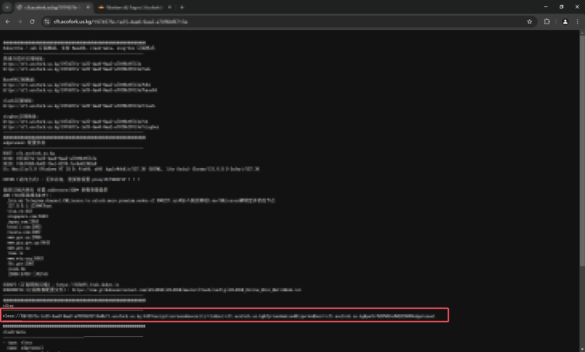

# 将Cloudflare作为代理使用（Vless - EdgeTunnel）

下面内容参考自：[CF VLESS 从入门到精通 cmliu/edgetunnel 必看内容 免费节点 优选订阅 Workers & Pages CM喂饭干货满满24 | CMLiussss Blog](https://vercel.blog.cmliussss.com/p/CM24/) 请支持原创作者！

1. 进入 https://github.com/cmliu/edgetunnel/archive/refs/heads/main.zip 将它上传到你的Cloudflare Pages项目
2. 进入 https://it-tools.tech/uuid-generator 随机获取一个uuid
3. 添加一个名称为`UUID`的变量绑定，值为第二步随机获取的（请不要泄露给他人！）
4. 重新上传第一步的`main.zip`。让Cloudflare重新部署page以适配新变量
5. 绑定自定义域名。通过 https://你的自定义域名/uuid 查看仪表盘
6. 复制`vless`开头的连接，打开V2Ray，导入。V2Ray客户端下载地址在文章最后500Mbps的移动宽带，通过edgetunnel测速速度如下

# 将你自己的国外VPS作为代理使用

## 新协议：Hysteria2

可以前往这两个仓库进行一键安装~

::github{repo="0x0129/hysteria2"}

::github{repo="seagullz4/hysteria2"}

大致安装过程：自签名，不使用acme，不使用端口跳跃

客户端（Hiddify）：

::github{repo="hiddify/hiddify-app"}

其他客户端在第二个Github Repo获取

## 旧协议：V2Ray

::github{repo="233boy/v2ray"}

VPS安装脚本：`bash <(curl -s -L https://git.io/v2ray.sh)`

详细安装：脚本执行完毕后输入`v2ray`更改配置为Shadowsocks

Windows客户端： [Releases · 2dust/v2rayN · GitHub](https://github.com/2dust/v2rayN/releases)

Android客户端： [Releases · 2dust/v2rayNG · GitHub](https://github.com/2dust/v2rayNG/releases)
