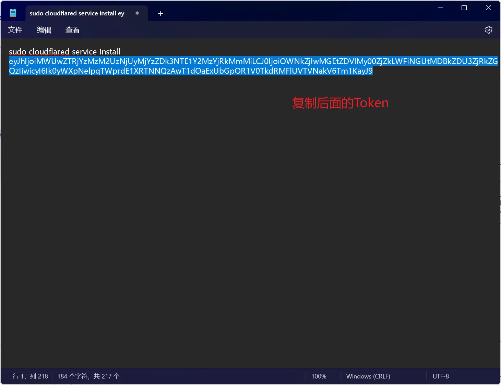
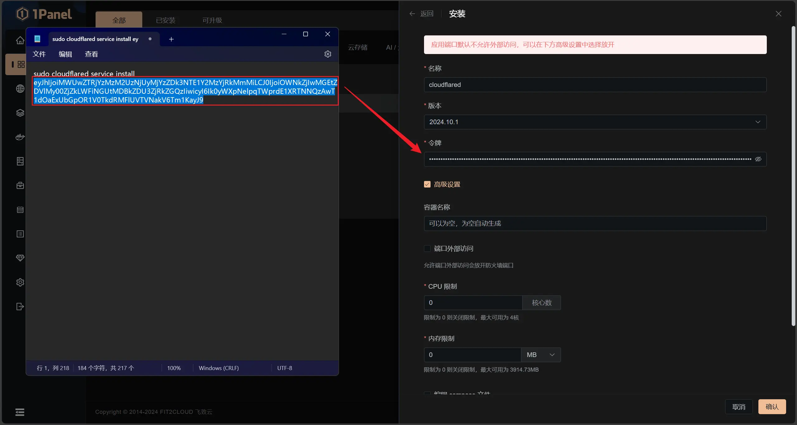

# 啥是内网穿透？

当我们在家中有个NAS，想要在学校/公司的网络来访问，就需要用到内网穿透，实现外网访问内网服务。原理一般是P2P打洞和服务器中转流量

---

# 前期准备

路由器开启UPnP  

关闭路由器的IPv4，IPv6防火墙 **（可选）**

# *使用Zerotier/Tailscale进行内网穿透*

> 他们俩的原理都是尝试对端建立P2P连接，需要对端安装一个软件并且长期运行

# 使用Zerotier进行内网穿透的详细教程

## 创建Zerotier账号

前往：[ZeroTier | Global Networking Solution for IoT, SD-WAN, and VPN](https://www.zerotier.com/)。如果你进不去，请尝试挂梯子。如果看不懂英文可以开启浏览器的翻译功能

选择 `Sign up`

如果你到了这个界面，请仍然选择`Sign up`


账号创建完毕后，登录即可

## 创建一个新的Zerotier网络组

当你账号登录成功后，会自动跳转到这个页面，点击`Create A Network`。如果没有，请访问[ZeroTier Central](https://my.zerotier.com/)


下面的列表会增加一个新的网络组，点击它

Zerotier默认的网络组模式为`Private`。即私密模式，哪怕别人知道了你的`Network ID`尝试加入你的网络组也需要你进行验证


复制这个`Network ID`

---

# 在设备上安装Zerotier应用

## Windows：

前往[Download - ZeroTier](https://www.zerotier.com/download/)，下载exe安装文件

打开Zerotier

查看右下角托盘，按照图片操作加入网络组

这里可以查询到你的设备ID和你在这个网络组的IP


**然后参考：[Zerotier授权设备](#zerotier授权设备)**

## Linux（飞牛OS）：

通过SSH连接上你的Linux设备

查看安装命令：[Download - ZeroTier](https://www.zerotier.com/download/)

终端执行： `curl -s https://install.zerotier.com | sudo bash`

看到这一行即安装完毕，后面那一串即你的设备ID：

加入网络：`sudo zerotier-cli join 你的Network ID`

**然后参考：[Zerotier授权设备](#zerotier%E6%8E%88%E6%9D%83%E8%AE%BE%E5%A4%87)**

## Android（安卓）

下载客户端

1. Zerotier One：[ZeroTier One APK Download for Android - Latest Version](https://apkpure.net/zerotier-one/com.zerotier.one)

2. ZerotierFix：[Releases · kaaass/ZerotierFix](https://github.com/kaaass/ZerotierFix/releases)

如图操作


**然后参考：[Zerotier授权设备](#zerotier%E6%8E%88%E6%9D%83%E8%AE%BE%E5%A4%87)**

---

# Zerotier授权设备

前往Zerotier的网页控制台：[ZeroTier Central]([https://my.zerotier.com/](https://my.zerotier.com/))

授权刚才加入的设备

勾选然后保存

---

# Zerotier访问测试

如果你同一个网络组里已经有两台以上的设备了，可以尝试ping一下测试连通性，请先确保两台设备不在同一个局域网（比如手机开流量，NAS用家里的无线网）

IP可以在这里查看

ping测试：

---

# 使用Tailscale进行内网穿透的详细教程

## 创建Tailscale账号

前往：[Tailscale](https://login.tailscale.com/start)。如果你进不去，请尝试挂梯子。如果看不懂英文可以开启浏览器的翻译功能

选择任意一个登录方式

账号创建完毕后，登录即可

---

# 在设备上安装Tailscale应用

## Windows：

前往[Download · Tailscale](https://tailscale.com/download)，下载exe安装文件

官方教程：

## Linux（飞牛OS）：

通过SSH连接上你的Linux设备

查看安装命令：[Download · Tailscale](https://tailscale.com/download/linux)

终端执行： `curl -fsSL https://tailscale.com/install.sh | sh`

等待安装完毕后输入：`tailscale login`

打开弹出的浏览器窗口，登录你的账号即可

## Android（安卓）

下载客户端（Google Play）：[Download · Tailscale](https://tailscale.com/download/android)

登录你的账号即可

---

## Tailscale访问测试

前往Tailscale的网页控制台：[Machines - Tailscale](https://login.tailscale.com/admin/machines)。可以查看到每个设备Tailscale分配的IP

ping测试

---

# 使用Cloudflare Tunnel进行内网穿透

> 这种方法可以不进行任何配置直接在公网上被访问，但是仅限Web服务。如果你想穿透游戏服务器等则不可用。你需要先将域名托管到Cloudflare

创建Cloudflare账号[主页 | Cloudflare](https://dash.cloudflare.com/)

进入[Cloudflare One](https://one.dash.cloudflare.com/)（需要绑定PayPal）

如图操作，创建一个Tunnel

## Docker方式

**使用1Panel**

复制如图的命令


将其粘贴，并且复制后面的令牌

1Panel应用商店搜索`cloudflared`

填入令牌

然后前往[查看IP](#查看cloudflared的ip)

**使用命令运行**

复制底下的命令然后SSH连接到Linux（飞牛OS）在终端输入


然后前往[查看IP](#%E6%9F%A5%E7%9C%8Bcloudflared%E7%9A%84ip)

### 查看cloudflared的IP

因为我们是Docker模式，所以IP需要通过SSH终端输入`ip a`来查看。我这里是`192.168.124.34`

```
root@n100-debian:~# ip a
1: lo: <LOOPBACK,UP,LOWER_UP> mtu 65536 qdisc noqueue state UNKNOWN group default qlen 1000
    link/loopback 00:00:00:00:00:00 brd 00:00:00:00:00:00
    inet 127.0.0.1/8 scope host lo
       valid_lft forever preferred_lft forever
    inet6 ::1/128 scope host noprefixroute
       valid_lft forever preferred_lft forever
2: ens18: tiROADCAST,MULTICAST,UP,LOWER_UP> mtu 1500 qdisc fq_codel state UP group default qlen 1000
    link/ether bc:24:11:33:e1:7d brd ff:ff:ff:ff:ff:ff
    altname enp0s18
    inet 192.168.124.34/24 brd 192.168.124.255 scope global dynamic ens18
       valid_lft 46579sec preferred_lft 46579sec
    inet6 2409:8a30:320:a170:be24:11ff:fe33:e17d/64 scope global dynamic mngtmpaddr
       valid_lft 1902sec preferred_lft 1898sec
    inet6 fe80::be24:11ff:fe33:e17d/64 scope link
       valid_lft forever preferred_lft foreverti
```

**然后前往[配置并访问Tunnel](#配置并访问tunnel)**

## 原生模式（以Debian为例）

选择Debian，然后复制底下的命令，直接到终端执行


如果你的环境无法连接上Github

尝试手动下载：[https://github.com/cloudflare/cloudflared/releases/latest/download/cloudflared-linux-amd64.deb](https://github.com/cloudflare/cloudflared/releases/latest/download/cloudflared-linux-amd64.deb)

然后将其通过SSH等方式传到Linux上，如图终端为MobaXterm

然后使用：`dpkg -i cloudflared-linux-amd64.deb`安装这个软件包

然后直接复制右边的命令到SSH终端执行

**然后前往[配置并访问Tunnel](#%E9%85%8D%E7%BD%AE%E5%B9%B6%E8%AE%BF%E9%97%AEtunnel)**

## Android（Termux）

在Android上安装[Termux | The main termux site and help pages.](https://termux.dev)

在终端执行：`pkg install cloudflared`

选择`Debian`然后复制最右边的命令到终端执行
如果你无法使用Termux自带的cloudflared，请尝试安装proot容器实现

依次输入命令：

```shell
pkg update && pkg upgrade
pkg install proot
pkg install proot-distro
proot-distro list
proot-distro install debian
proot-distro login debian
apt install wget
wget https://github.com/cloudflare/cloudflared/releases/download/2024.10.1/cloudflared-linux-arm64.deb
dpkg -i cloudflared-linux-amd64.deb
```

然后直接复制右边的命令到SSH终端执行


如果你无法通过令牌配置cloudflared，请参见[本地方式配置cloudflared](#本地方式)

**然后前往[配置并访问Tunnel](#%E9%85%8D%E7%BD%AE%E5%B9%B6%E8%AE%BF%E9%97%AEtunnel)**

---

# 配置并访问Tunnel

## 通过网页配置

> 这种方法需要直接在安装了cloudflared的设备上通过令牌运行

如图进入，创建一个HTTP隧道


填写你的IP和端口，非Docker模式可以直接填写localhost

## 本地方式

> 这种方法只需要在安装了cloudflared的设备上输入一些命令然后通过网页授权，后续更改配置也需要在本地操作

登录并授权：`cloudflared tunnel login`

创建隧道并设置隧道（HTTP模式穿透，目标地址`127.0.0.1`，端口：`8080`，外部域名：`test.onani.cn`）：`cloudflared tunnel --name test --url http://127.0.0.1:8080 --http2 --hostname test.onani.cn`

## 访问测试

成功访问

# 使用STUN打洞

> 这种方法可以不进行任何配置直接在公网上被访问，并且所有类型的服务都能正常使用。但是这种方式进行的内网穿透无法固定也无法指定IP和端口，在3~7天后会改变

## 安装Lucky

执行：`curl -o /tmp/install.sh http://6.666666.host:6/files/golucky.sh && sh /tmp/install.sh http://6.666666.host:6/files 2.13.4`

通过`host:16601` 进入Lucky后台，设置STUN穿透。如果DMZ主机不设为Lucky主机可能会失败。打码的地方即公网访问的IP和端口
